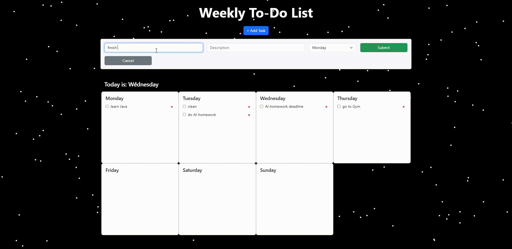

# Weekly To-Do List App

## Overview

Weekly To-Do List is a fullstack web app that lets you manage tasks by days of the week. It supports add and delete tasks, drag-and-drop between days, task completion toggles, and a beatiful particles background.
## Features

- Weekly layout with separate columns per day
- Drag and drop tasks between days
- Mark tasks as completed
- Runs H2 Database locally without need for API keys

## Tech stack:

Frontend: React/TypeScript + Bootstrap

Backend: Java + Spring Boot + H2 Database +Maven

CORS Ready: Supports localhost ports 3000–3003
## Installation

1. Clone the repository:
```bash 
git clone https://github.com/dangminh214/RAG-Ollama-simple.git
```

2. Backend (Spring Boot):
   Go into the backend folder:

```bash
weekly-todo-backend
./mvnw spring-boot:run
```

Or on Windows:
```bash
mvnw spring-boot:run
```

- Database server runs at: http://localhost:8080
- H2 Console: http://localhost:8080/h2-console

3.  CORS allows access from:
    http://localhost:3000, 3001, 3002, 3003

4. Frontend (React)
   Go into the frontend folder:

```bash
cd weekly-todo-frontend
npm install
npm start
```
5. H2 Database (config) :
- URL: http://localhost:8080/h2-console

- JDBC URL: jdbc:h2:mem:testdb

- Username: sa

- Password: (leave blank)
6. CORS Configuration
   Configured in CorsConfig.java to allow requests from:

.allowedOrigins(
"http://localhost:3000",
"http://localhost:3001",
"http://localhost:3002",
"http://localhost:3003"
)
you can change the localhost port as you wish

## Preview


##  License
MIT – Free to use, fork, and modify.

## Author
Tuan Minh Do

note: this is a personal project to learn Java
